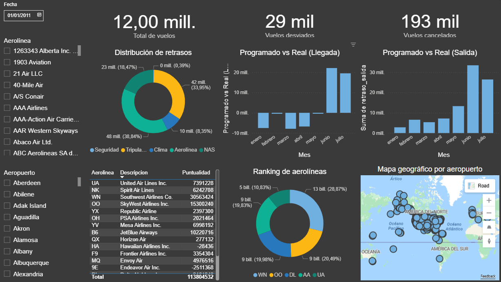

# Proyecto Final Grupo #3

## Integrantes
* Luis Fernando Culajay Sandoval | 3548487470101
* Karen Lisbeth Morales Marroquin | 3638451000101
* Jhonatan Emmanuel Simon Romano | 1703790780101
* Brandon Rene Portillo González | 3075926690603

## Descripcion 

Evaluar la aplicación efectiva del contenido del curso de Introducción al Análisis de Datos y otras estrategias según la metodología  CRISP-DM mediante la construcción de una solución analítica completa usando datos reales de transporte aéreo de Estados Unidos.

## Dataproduct
✅ Dashboard ([ver en línea](https://app.powerbi.com/view?r=eyJrIjoiOTljZWRhNGItYmM4ZS00OTZkLWEwMjktN2M0NzQzMTUxYWY4IiwidCI6IjIzYjVhMmVmLTM0OTYtNGEwYy04Y2ExLWI1ODM3OWI3YTQ0YyIsImMiOjR9))

